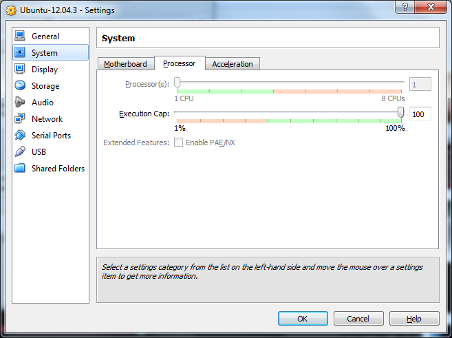
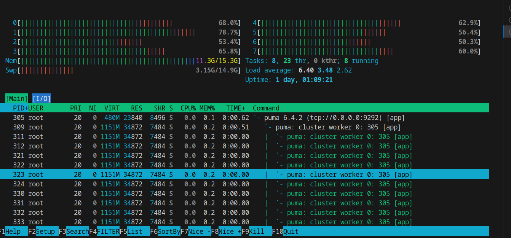

# iasc-practica-ruby

## Objetivos

- Comparar comportamiento de Puma en sus múltiples modos
- Comparar modelo de procesos y threads

Durante esta práctica estaremos utilizando Ruby 3.4.0 y JRuby 10.0.2.0.

## Instalacion de entornos

A Continuacion de detallan los pasos para instalar Ruby y JRuby.

### Docker (Opcional)

> Nota: Solo tomen en cuenta esta seccion si han usado y conocen Docker. Actualmente se tiene un docker compose con otra imagen para tirar carga y usa otras cosas como volumenes para facilitar la edicion y no tener que volver a buildear la imagen o hacerlo desde la linea de comando al crear el contenedor

La imagen tiene todas las dependencias instaladas junto con htop y ab (apache2-utils).
El comando por defecto del container `/bin/bash -l`

```bash
# Armar la imagen con tag rvm
docker build . -t iasc-practica-ruby
# Instanciar la imagen en un container con nombre rvm1
docker run --rm --name iasc-practica-ruby-cont -it iasc-practica-ruby -p 9292:9292
# Loguearse al container en otra terminal
docker exec -it iasc-practica-ruby-cont bash -l
# Para ver las versiones de ruby instaladas
rvm list
# Para usar Ruby 3.4.0 (mri es un alias)
rvm use mri
# Para usar JRuby 10.0.2.0 (jruby es un alias)
rvm use jruby
# Levantar el servidor (-t {minThreads}:{maxThreads} -w {workers})
bundle exec puma -t 4:8 -w 2
# Para probar los endpoints (c=conexiones concurrentes, n=cantidad de conexiones)
ab -c 10 -n 100 localhost:9292/io_bound
```

> La imagen de docker tambien expone su puerto 9292, para que pueda correrse ab desde afuera.

### Docker compose (Opcional)

Tambien puede usarse la configuracion de docker compose que viene con este repositorio. Esto permite que se pueda levantar la imagen de la practica, junto con otra imagen que viene con apache ab preinstalado.

para esto basta con levantar docker compose

```bash
docker-compose up
```

Debido a que en la practica estaremos levantando seguido el servidor, cambiando los argumentos o el codigo, el directorio donde se monta la aplicacion es un volumen, con lo cual los cambios hechos se persisten hasta que se vuelva a recrear el volumen.

Para entrar al contenedor de la aplicacion basta con hacer

```bash
docker exec -it practica-ruby /bin/bash -l
```

de ahi se puede levantar normalmente

```bash
bundle exec puma -t 4:8 -w 2
```

La otra imagen, llamada `alpine-ab`, es una imagen basica para levantar carga, se puede entrar a este contenedor para tirar carga mediante el siguiente comando:

```bash
docker exec -it alpine-ab /bin/bash
```

de ahi, existe la carpeta `/scripts`, que posee dos scripts para hacer los distintos tipos de request. En caso de que se quieran modificar, se puede usar vi.

para ejecutar un script basta con hacer:

```bash
./scripts/ab_io_requests.bash
```

### Usando la imagen de lubuntu (Virtualbox)

En caso de que usen la imagen de lubuntu mediante Virtualbox hay que setear la misma para que utilice mas de un core (CPU)



## Instalacion Ruby

Instalar [rvm](https://rvm.io).

```bash
gpg --keyserver hkp://pool.sks-keyservers.net --recv-keys 409B6B1796C275462A1703113804BB82D39DC0E3 7D2BAF1CF37B13E2069D6956105BD0E739499BDB
\curl -sSL https://get.rvm.io | bash
echo "source $HOME/.rvm/scripts/rvm" >> ~/.bash_profile
```

Y luego, instalar Ruby y [bundler](http://bundler.io/):

```bash
rvm install 3.4.0
rvm use 3.4.0
gem install bundler
```

Instalar tambien jruby (Java 21+ es requerido):

```bash
rvm get head
rvm install jruby-10.0.2.0
gem install bundler
```

### Instalacion de proyecto

Una vez que instalamos RVM, ejecutar las siguientes instrucciones:

```bash
bundle install
```

Esto instalará las dependencias y de aqui en más se puede proceder con la primera parte de la práctica.

Ante cualquier duda referirse a la documentacion de la [página](https://rvm.io/rvm/install)


### Htop

Esta herramienta puede ser util para responder varias de las preguntas de la consigna. Recomendamos fuertemente leer la consigna primero, levantar el servidor, ver de que funcione correctamente y puedan hacerse requests a este; antes de leer en profundidad esta seccion.

#### ¿Qué puedo hacer desde htop?

Se puede ver con htop los procesos levantados y los recursos actuales. En este caso puede servir para ver la carga de los threads que se hayan levantado desde el servidor.

> htop esta disponible tanto en la imagen de docker de la aplicacion, como en la maquina virtual.

Se puede hacer un filter con `F4` y filtrar por la palabra `puma`


Despues de eso se puede ver los threads de manera de lista o arbol, con `F5`



En caso de que surjan dudas de puma, consultar con la seccion de FAQ o ver la documentacion de puma.

## Consigna

### Generalidades

Esta práctica se realizará en varios escenarios. Para cada uno:

- analizar el comportamiento de ambas rutas, anotarlo y comparar con las configuraciones anteriores.
- analizar qué cantidad de threads del sistema operativo se crean (con `htop`)
- probar tanto con un cliente como con varios clientes concurrentes

El objetivo no es obtener tiempos exactos sino entender cualiativamente los modelos de SO Threads, Green Threads y Procesos.

#### Escenarios

1. Ejecutar utilizando Ruby con Puma, un proceso y un hilo
2. Ejecutar utilizando Ruby con Puma, N procesos (_clustered_) y un hilo
3. Ejecutar utilizando Ruby con Puma, 1 Proceso y N hilos
4. Ejecutar utilizando Ruby con Puma, N procesos (_clustered_) y N hilos
5. Ejecutar utilizando Jruby con Puma, 1 proceso y N hilos

### Preguntas para poder prepararse antes de la conclusión

#### Que buscamos como conclusión?

A partir de los escenarios, lo que nos gustaria que vean es:

Comparacion de las dos VMs que usan en la practica, MRI y Jruby, y como afecta al sistema:

- Como se comportaria el sistema de acuerdo a cada uno de los escenarios para las dos VMs
- Y para cada escenario, que diferencia hay entre los endpoints de io y cpu bound?

#### Preguntas que pueden hacerse antes de empezar a sacar conclusiones

A partir de las mediciones y comparaciones en cada escenario, deberían poder responder:

- Bajo green threads, si la cantidad de threads aumenta ¿mejora la performance de una tarea cpu bound?
- Bajo green threads, si la cantidad de threads aumenta ¿mejora la performance de una tarea IO bound?
- Bajo SO threads, si la cantidad de threads aumenta ¿mejora la performance de una tarea cpu bound?
- Bajo N procesos (modo clustered), si la cantidad de procesos aumenta por encima de la cantidad de cores de la máquina, ¿mejora la performance de una tarea cpu bound?
- Los Green threads de Ruby, ¿son realmente green threads? (Tip: analizar mediante `htop` si el sistema operativo los ve)

### FAQ

#### ¿Cómo lanzar el servidor?

Simplemente hay que ejecutar el comando `puma` mediante `bundle exec`:

```
bundle exec puma
```

#### ¿Cómo probar el servidor?

El servidor soporta dos rutas: `/io_bound` y `/cpu_bound`. Como sus nombres lo indican, la primera realiza una tarea con mínimo procesamiento pero gran cantidad de E/S (lee un archivo), y la segunda es código puro (ejecuta una función fibonacci).

Para probarlas, se puede utilizar por ejemplo:

- `curl` (desde la terminal)
- `ab` Apache AB (desde la terminal)

Recomendamos usar `ab`, ya que esta herramienta permite realizar múltiples requests con único comando, de forma concurrente. Esto les va a permitir ver más claramente cómo distintas configuraciones de puma afectan el funcionamiento de su servidor.

El repo ya cuenta con dos scripts que utilizan `ab`: `ab_cpu_requests.bash` y `ab_io_requests.bash`. Estos scripts contienen las opciones que nos interesan para esta práctica:
- `-n`: número total de requests a realizar
- `-c`: cantidad de requests concurrentes

Siéntanse libres de modificar estos scripts en base a las pruebas que quieran realizar.

#### ¿Cómo controlar la cantidad de hilos y procesos

El comando `puma` acepta dos parámetros para controlarlos `-t` y `-w`:

- `-t` define la cantidad mínima y máxima de threads
- `-w` define la cantidad de procesos (llamados _workers_)

Por ejemplo:

```
# Lanzar puma con 4 hilos
bundle exec puma -t 4:4

# Lanzar puma con 1 proceso
bundle exec puma -w 1

# Lanzar puma con 2 procesos
# (lo que se conoce como modo clustered, es decir, que  la cantidad de workers > 1)
bundle exec puma -w 2
```

Estas opciones son combinables.

#### ¿Qué hago si la tarea cpu bound termina demasiado rápido/demasiado lento en mi máquina?

Ajustá el valor del fibonacci en `config.ru`

```
get '/cpu_bound' do
  # Ajustá el valor del 34 para lograr un calculo que se tome su tiempo pero termine
  {result: fib(34)}.to_json
end
```

#### ¿Cómo hago para correr este servidor con Ruby? ¿Y con JRuby?

Las instrucciones anteriores corren este servidor con Ruby estándar (MRI, también llamado YARV). Para ejecutarlo con JRuby, es necesario cambiar el intérprete a mano e instalar bundler :

```
rvm use jruby-9.2.8.0
gem install bundler
```

y luego ejecutar `puma` normalmente.

#### ¿Qué puedo hacer si quiero correr (por algún motivo) el servidor con otra versión de ruby?

Tenés que

- modificar el archivo `.ruby-version` y el `Gemfile`,
- luego `gem install bundler`
- luego `bundle install`

Y eso es todo.